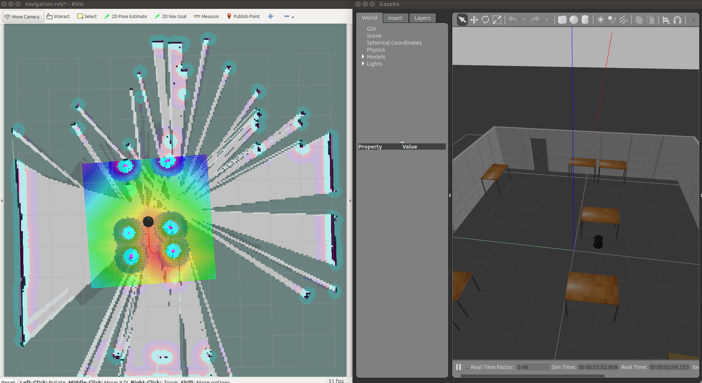
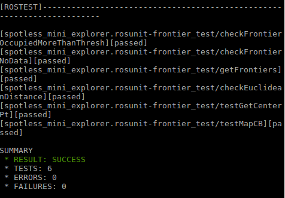
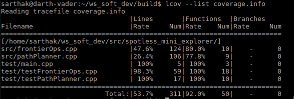

# Frontier Exploration Robot
[](https://travis-ci.org/smahajan07/spotless_mini_explorer)
[](https://coveralls.io/github/smahajan07/spotless_mini_explorer?branch=master)

[](https://opensource.org/licenses/MIT)

## Overview
Autonomous robots have been an active field of research before and since the DARPA Grand Challenge in 2005 and the Urban Challenge in 2007. Even after a decade, autonomous robots are helping solve problems in a diverse space and creating potential applications of the future. Autonomous robots are now present in different spaces such as self driving cars, sidewalk-delivery robots, autonomous sea explorers and autonomous drones and every environment setting brings along myriad of challenges and while some might be generic others might be particular to that setting. 

The aim of this package is to introduce the user to a specific problem in the field of autonomous robots, i.e. frontier exploration. When a robot navigates in a known space, some of the localization (knowing the location of the robot in the physical space) problems are easy to solve, however if the robot is placed in an unknown environment the way to tackle localization is to create a map of your surrounding simultaneously. This is usually referred to as the chicken and egg problem but for now let's assume that is being taken care of. The interesting part that we will solve is to autonomously perform this task!

In order to autonomously exlpore an unknwon space, the robot needs to keep visiting the _unknown_ parts in its map and stop only if commanded or if there are no more _unknown_ spaces left. This is the key concept behind frontier exploration. Sounds simple, right!

__Implementation__

For the scope of this package, we will be using a turtle bot, which is small yet powerful robot with a lot of support available online and the algorithms implemented on the turtle bot can be scaled up to differenct robots. Certain packages are already provided to solve the task of mapping and navigation such as gmapping and move_base respectively. 

_Visiting_ the unknown parts involves computing the route to a goal and this can be done via many different algorithms and for this package a variant of Breadth First Search is selected for it's simplicity and effeciency. Gazebo will be used for simulation and [Optional] RVIZ for visualization.

The project is programmed in C++ and uses modern C++ features and strongly follows the concepts of Object Oriented Programming. The project follows a Test Driven Development approach and a Solo Iterative Process (SIP). Doxygen documentation id also provided for reference. 

For reference, this is how it looks when the package is run:


__Applications__

The primary aim of this package is to help ACME robotics in it's frontier exploration tasks but it can be scaled in the future and run as a complementary module for other exploration robots with complicated tasks such as industrial inspection.

## Dependencies
The following dependencies need to be met before installing this package:
* [ROS Kinetic](http://wiki.ros.org/ROS/Installation) on Ubuntu 16.04
* [Gazebo 7.x](http://gazebosim.org/download)
* [Turtlebot](http://wiki.ros.org/turtlebot) and [Turtlebot_Gazebo](http://wiki.ros.org/turtlebot_gazebo)
* [Move Base](http://wiki.ros.org/move_base) (Ideally this is a part of standard ROS installation, please download if not already installed)

## Video demonstration
The user can also refer to the following presentation slides and the video for more details about the project and video demo to see how to build, run tests or run the demo.
(Section to be updated)

## Instructions to Build
* If you already have a catkin workspace then:
```
cd <catkin workspace>
cd src
git clone https://github.com/smahajan07/spotless_mini_explorer.git
cd ..
catkin_make
source devel/setup.bash
```

* If you do not have a catkin workspace, you can create one by following:
```
mkdir -p ~/catkin_ws/src
cd ~/catkin_ws/
catkin_make
source devel/setup.bash
cd src/
git clone https://github.com/smahajan07/spotless_mini_explorer.git
cd ..
catkin_make
```
## Instructions to run tests
Before you proceed to run it, check whether it passes the unit tests:
```
cd <your catkin workspace>
source devel/setup.bash
catkin_make run_tests
```
This should end with an output like



## Instructions to run Demo
Two terminals would be required for this, so in the first terminal: 
```
cd <your catkin workspace>
source devel/setup.bash
roslaunch spotless_mini_explorer demo.launch
```
In the second terminal, run:
```
rosrun spotless_mini_explorer frontier_explorer
```
Note: Gazebo is known to fail sometimes and in case it does fail to open, please kill tasks in both terminals and try again.

At any point in time is the user wishes to save the map built, open a terminal and run:
```
rosrun map_server map_saver -f <map_name>
```
Note: This will save a map in your CURRENT working directory, so it's best to call it from a directory of your choice (say, results) or give the appropriate path.

Moreover, the demo will potentially run for a long time, basically till it maps the unknown space, so in order to kill the demo please press CTRL+C in the active terminals.

## Rosbags
(Section to be updated)

## Track progress
The development followed a Solo Iterative Process and the progress can be tracked via the following links:
* [SIP Google Sheet](https://docs.google.com/spreadsheets/d/1qItKc6DQDyJmSBWIZsrJj505HqRsbLVi_X6wqlamRMk/edit#gid=0)
* [Planning Log](https://docs.google.com/document/d/1M3QvbsZYWknKas6uhFjU1NELlZafBw9uz3sJWOEfes0/edit)

## Code coverage
The current code coverage is 92%.

Since there is currently some issue with coveralls picking up the build from travis and checking for code coverage, provided below is a screenshot of the coverage report generated using lcov, locally:


Instructions to run code coverage:
```
cd <your catkin workspace>
cd build/
lcov --directory . --capture --output-file coverage.info
lcov --remove coverage.info '/opt/*' '/usr/*' '*/devel/*' '*test_*' '*_test*' --output-file coverage.info
lcov --list coverage.info
```

## Known issues/bugs
(Section to be updated)

## Doxygen
(Section to be updated)

## About the developer
My name is Sarthak Mahajan and I'm currently pusruing my Masters of Engineering in Robotics and University of Maryland, College Park. My areas of interest are computer vision, machine learning and deep learning. I have worked on multiple projects in these areas and keep trying to do more hands on projects. As a budding roboticist, I love to work towards solving real world problems. Working on ROS (and other open source projects) has made me appreciate the value of an open source community and I would like to contribute back to such communities.

## Disclaimer
This package has been created as a part of the course ENPM 808X Software Development for Robotics. Please read the license for details on the terms and conditions of usage.

## License
[](https://opensource.org/licenses/MIT)
[MIT License](https://github.com/smahajan07/spotless_mini_explorer/blob/master/LICENSE)
